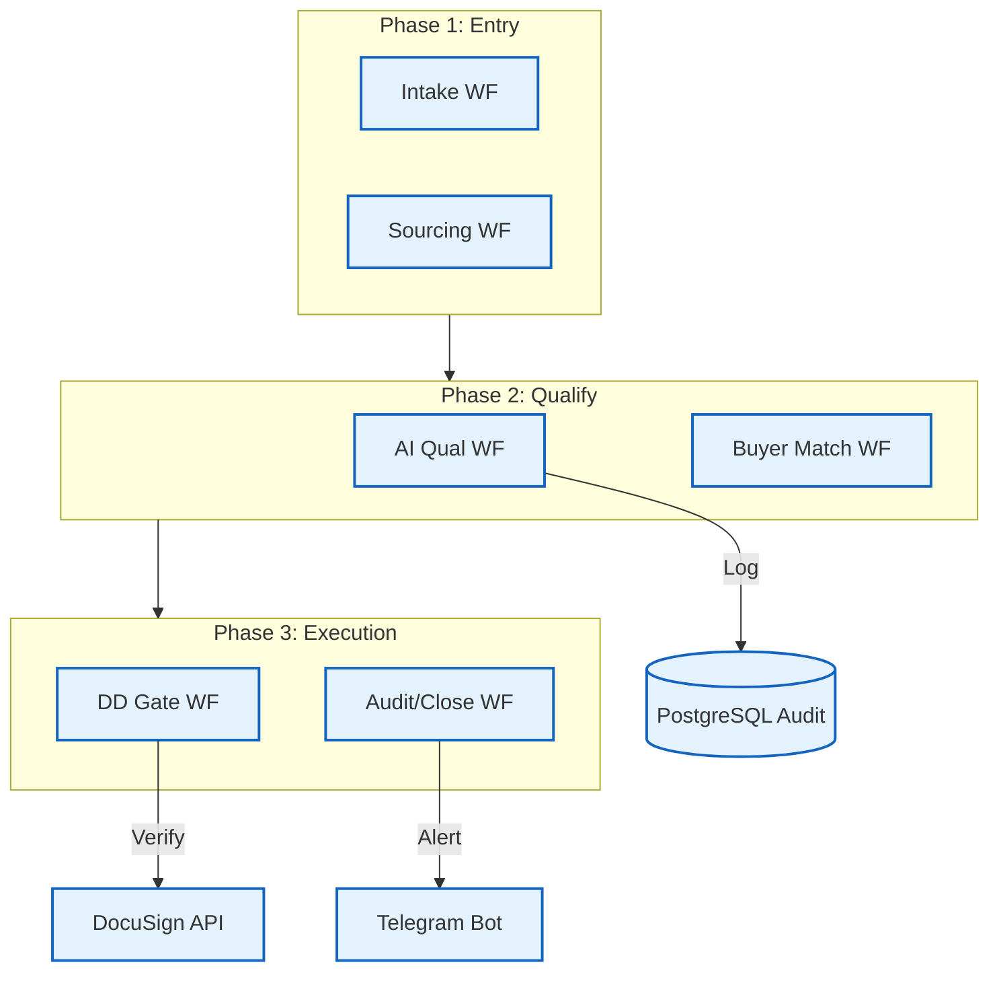

# 🏗️ Technical Architecture — edugrow-ma-platform

## Components
- **State-Machine Engine**: The core logic that ensures deals proceed through stages (Intake -> NDA -> DD -> Closing) without skipping steps.
- **AI Qualification**: A GPT-4 assisted module that summarizes deal decks and highlights risks for advisors.
- **Audit Module**: A centralized service that captures 100% of event data into an append-only PostgreSQL table.

## Data Flow
1. **Initiation**: A new deal is created in the intake workflow, triggering a state record in PostgreSQL.
2. **Analysis**: Documents are analyzed by AI to determine sector fit and financial viability.
3. **Execution**: The system automates NDA issuance via DocuSign and tracks signatures.
4. **Due Diligence**: A gated portal opens for buyers, where document access is logged and tracked.
5. **Notification**: Stakeholders receive real-time updates via Telegram and Email at every milestone.

## Resilience & Compliance
- **Dead-Letter Queues (DLQ)**: Failed DocuSign requests are moved to a DLQ for manual intervention rather than stopping the workflow.
- **Exponential Backoff**: 5× retry logic ensures that API outages don't break the long-running deal lifecycle.
- **Idempotency**: Workflow triggers are de-duplicated to prevent multiple NDAs from being sent for the same deal.

## Confidentiality
Due to the extreme sensitivity of M&A data, all database schemas, specific qualification prompts, and workflow JSON exports are strictly withheld.
