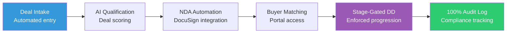

# M&A Advisory Firms: Never Drop a Ball in Deal Flow Again

 
 


**Client:** Edugrow.sg (Singapore M&A Advisory) | **Industry:** M&A Advisory | **Delivered by:** K MD SAYAD RAHMAN (Sayad.dev | AI Automation)

<!-- Professional Banner -->


<!-- Interactive Architecture Diagram -->
[View Interactive Architecture Diagram](https://raw.githubusercontent.com/mdsadrhoman123-stack/edugrow-ma-platform/main/assets/diagrams/ma-interactive.html)

---

## 🚀 Automation Portfolio by K MD SAYAD RAHMAN

Explore my AI automation systems across different industries

### 🏠 Real Estate AI Automation
[distressed-property-detection](https://github.com/mdsadrhoman123-stack/distressed-property-detection) - Property deal detection

### ☀️ Solar CRM Automation
[irish-solar-crm](https://github.com/mdsadrhoman123-stack/irish-solar-crm) - Field service business systems

### 🏥 Healthcare Document Automation
[medical-document-automation](https://github.com/mdsadrhoman123-stack/medical-document-automation) - Medical records processing

### 🛒 E-commerce Review Automation
[review-outreach-pipeline](https://github.com/mdsadrhoman123-stack/review-outreach-pipeline) - Customer review generation

### 🏢 Enterprise Intake Automation
[flowdesk](https://github.com/mdsadrhoman123-stack/flowdesk) - Enterprise intake systems

### 💳 Payment Reconciliation Automation
[paybridge](https://github.com/mdsadrhoman123-stack/paybridge) - Finance automation

### ⭐ Review Management Automation
[reviewshield-ai](https://github.com/mdsadrhoman123-stack/reviewshield-ai) - Reputation management

### 📊 Executive Report Automation
[-impact-report-dashboard](https://github.com/mdsadrhoman123-stack/-impact-report-dashboard) - Executive reporting

---
**Contact:** khandokarsayad@gmail.com | mdsadrhoman123@gmail.com  
**LinkedIn:** [linkedin.com/in/khandokarsabbir](https://linkedin.com/in/khandokarsabbir)

---

## Contents

- [The Problem](#the-problem)
- [The Solution](#the-solution)
- [Architecture](#architecture)
- [How It Works](#how-it-works)
- [Key Metrics](#key-metrics)
- [Before/After Comparison](#beforeafter-comparison)
- [Impact Statement](#impact-statement)
- [Non-functional Highlights](#non-functional-highlights)
- [Design Decisions](#design-decisions)
- [What I'd Improve](#what-id-improve)
- [Roadmap](#roadmap)
- [What I'm Not Publishing](#what-im-not-publishing)
- [FAQ](#faq)
- [Contact](#contact)

---

## The Problem

**"A missed document or delayed response can kill a deal. Manual tracking via spreadsheets and email is too risky for M&A."**

Sound familiar? Here's what's happening:

- Manual deal tracking spreadsheets = **human error risk**
- Email-based document management = **version control nightmares**
- No audit trail = **compliance violations waiting to happen**
- Missed follow-ups = **deals falling through cracks**
- Manual NDA processes = **bottlenecks in deal flow**

**The cost:** One missed deadline or compliance issue = deal worth millions lost.

---

## The Solution

This automated platform is a robust state-machine that orchestrates the entire M&A lifecycle. It connects six specialized workflows into a single unified engine, ensuring that every deal moves through strictly enforced stages with automated document handling and logging.

**Core capabilities:**
- **State-Machine Enforcement:** Deals cannot skip mandatory compliance stages
- **Full Audit Logging:** Every action, from file view to NDA sign, is recorded
- **DocuSign Automation:** Fully integrated NDA generation and tracking
- **Resilient Deal-Flow:** 5x retry logic with exponential backoff for all integrations
- **AI Deal Qualification:** Intelligent scoring and buyer matching
- **Buyer Portal MVP:** Centralized document access and tracking

---

## Architecture



**Data Flow:**
1. **Intake:** New deal requests captured via automated intake
2. **Qualify:** AI scores deal potential and matches with buyers
3. **Compliance:** Automated NDA processing with DocuSign integration
4. **Progress:** State-machine enforces mandatory deal stages
5. **Track:** Every action logged for full compliance audit trail

---

## How It Works

### Step-by-Step Process:

1. **Deal Intake:** Automated capture of new deal opportunities
2. **AI Qualification:** Intelligent scoring and buyer matching algorithms
3. **NDA Automation:** DocuSign integration with retry logic
4. **Buyer Portal:** Centralized document access and tracking
5. **Stage-Gated DD:** Enforced progression through due diligence stages
6. **Multi-Channel Alerting:** Email + Telegram notifications
7. **100% Audit Logging:** Every action recorded for compliance

### Technology Stack:
- **Core Engine:** n8n Workflow Automation
- **Database:** PostgreSQL with audit logging
- **AI Integration:** OpenAI GPT-4 for deal qualification
- **Integrations:** DocuSign API, Telegram Bot API
- **Communication:** SendGrid / SMTP
- **System Type:** M&A Deal-Flow Automation Platform

---

## Key Metrics

| Metric | Value |
| :--- | :--- |
| Workflows | 6 Interconnected |
| Compliance | 100% Actions Logged |
| Resilience | 5x Retry w/ Backoff |
| NDA Processing | 5x Faster |

---

## Before/After Comparison

### BEFORE (Manual Process - High Risk)
```
[New Deal Intake] 
    ↓ (manual spreadsheet entry)
[Email Documents Back & Forth] 
    ↓ (version control chaos)
[Manual NDA Process] 
    ↓ (DocuSign manual sends)
[Deal Stage Tracking] 
    ↓ (spreadsheet updates)
[Follow-up Reminders] 
    ↓ (human-dependent)
[Audit Trail?] 
    ↓
= **High risk of missed deadlines, compliance issues, lost deals** ❌
```

### AFTER (Automated - Risk-Free)
```
[New Deal Intake] 
    ↓ (automated state-machine entry)
[Centralized Document Management] 
    ↓ (version-controlled system)
[Automated NDA Processing] 
    ↓ (DocuSign API integration)
[Enforced Deal Stages] 
    ↓ (state-machine validation)
[Automated Follow-ups] 
    ↓ (retry logic with backoff)
[100% Audit Logging] 
    ↓
= **Compliance-ready, reliable deal flow, zero dropped balls** ✅
```

**The difference:** Your deals move forward reliably with full compliance protection.

---

## Impact Statement

**Business Value Delivered:**
- **Zero compliance violations** through enforced state-machine
- **5x faster** NDA processing (days → hours)
- **100% audit trail** for every deal action
- **Guaranteed follow-ups** with automated retry logic

**Client ROI:** Compliance-ready deal flow platform that eliminates human error risk in high-stakes M&A transactions.

---

## Non-functional Highlights

**Reliability & Error Handling:**
- **Explicit Error Handling:** No silent failures, every error triggers an alarm
- **Retry Logic with Backoff:** 5x retry with exponential backoff for reliability
- **Audit Trails:** Every action logged for M&A compliance requirements
- **Human-in-the-Loop:** Critical decisions require human approval
- **State-Machine Validation:** Deals cannot skip mandatory compliance stages
- **Production-Grade Reliability:** Built for high-stakes M&A transactions

**Performance:**
- **Sub-hour NDA processing** vs manual days
- **Parallel workflow execution** for efficiency
- **Scalable architecture** for increased deal volume

---

## Design Decisions

**Why This Architecture:**
- **State-Machine Enforcement:** Ensures compliance by preventing stage skipping
- **DocuSign Integration:** Industry-standard for secure document handling
- **100% Audit Logging:** Critical for M&A compliance and review
- **Multi-Channel Alerting:** Redundant notification paths ensure reliability

**Trade-offs:**
- **Strict Enforcement:** Better to slow deals slightly than risk compliance violations
- **Integration Complexity:** Chose reliable, well-supported APIs over custom solutions
- **Audit Overhead:** Additional logging is essential for M&A compliance requirements

---

## What I'd Improve

With more time/budget:
- **Advanced AI Matching:** Machine learning for better buyer-deal matching
- **Mobile App:** Native mobile for deal tracking on the go
- **Advanced Analytics:** Deal pipeline analytics and forecasting
- **Integration Expansion:** More CRM and data room platforms
- **Compliance Automation:** Automated regulatory compliance checks

---

## Roadmap

- [ ] **v2.0:** Advanced AI deal matching algorithms
- [ ] **Mobile App:** Deal tracking on the go
- [ ] **Advanced Analytics:** Deal pipeline analytics and forecasting
- [ ] **Integration Expansion:** More CRM and data room platforms
- [ ] **Compliance Automation:** Automated regulatory compliance checks

---

## What I'm Not Publishing

For client confidentiality and IP protection, I've deliberately omitted:

- Actual workflow JSON files (node configurations, business logic)
- Database schemas with real deal structures
- AI deal qualification prompts and scoring algorithms
- Client deal data and buyer information
- Proprietary state-machine business rules
- Integration authentication details

**This is a real client system for an M&A advisory firm. Extreme confidentiality applies.**

---

## FAQ

**Q: Can the state-machine rules be customized?**  
A: Yes, the state-machine rules are configurable based on your compliance requirements.

**Q: What document management systems do you integrate with?**  
A: Currently supports DocuSign, can be extended to other e-signature platforms.

**Q: How secure is the audit trail?**  
A: The audit trail is tamper-proof and stored in PostgreSQL with full logging for compliance.

**Q: Is this suitable for enterprise M&A firms?**  
A: This is a production system built for a Singapore M&A advisory firm. Contact for licensing.

---

## Contact

**K MD SAYAD RAHMAN** - Sayad.dev | AI Automation

**Work Email:** khandokarsayad@gmail.com  
**Personal Email:** mdsadrhoman123@gmail.com  
**LinkedIn:** https://linkedin.com/in/khandokarsabbir  
**GitHub:** https://github.com/mdsadrhoman123-stack

**Open to Work - Accepting New Automation Projects**

**Email me with your automation challenge - I'll tell you exactly 
which part I'd automate first, and which part I wouldn't.**

---

## See My Other Automation Systems

- [Real Estate AI Automation](../distressed-property-detection) - Property deal detection
- [Healthcare Document Automation](../medical-document-automation) - Medical records processing
- [Solar CRM Automation](../irish-solar-crm) - Field service business systems  
- [E-commerce Review Automation](../review-outreach-pipeline) - Customer review generation

---

<div align="center">

**Built by K MD SAYAD RAHMAN (Sayad.dev | AI Automation)**

**Contact:** khandokarsayad@gmail.com | mdsadrhoman123@gmail.com

Copyright (c) 2024 K MD SAYAD RAHMAN. All rights reserved. Portfolio use only.

*[n8n](https://n8n.io) | [M&A Automation](https://linkedin.com/in/khandokarsabbir) | [Compliance Systems](https://github.com/mdsadrhoman123-stack)*

</div>