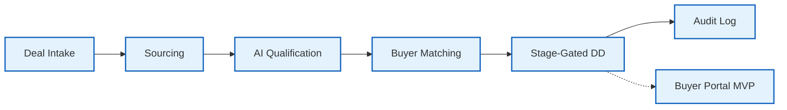
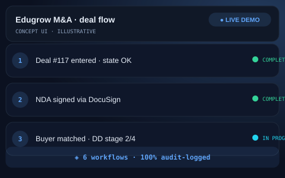

# 🤝 Edugrow.sg — M&A Deal-Flow Automation Platform
> M&A deal-flow platform for a Singapore advisory firm — six workflows, one state-machine, 100% audit logging.

   

## The Problem
Managing complex Mergers & Acquisitions (M&A) deal-flow via spreadsheets and email is a high-risk endeavor. Manual tracking leads to missed follow-ups, document versioning errors, and a total lack of a compliance-grade audit trail.

## The Solution
The Edugrow platform is a robust state-machine that orchestrates the entire M&A lifecycle. It connects six specialized workflows into a single unified engine, ensuring that every deal moves through strictly enforced stages with automated document handling and logging.
- **State-Machine Enforcement**: Deals cannot skip mandatory stages or compliance checks.
- **Full Audit Logging**: Every action, from file view to NDA sign, is recorded.
- **DocuSign Automation**: Fully integrated NDA generation and tracking.
- **Resilient Deal-Flow**: 5× retry logic with exponential backoff for all integrations.

## Architecture at a Glance

## Key Metrics
| Metric | Value |
| :--- | :--- |
| Workflows | 6 Interconnected |
| Compliance | 100% Actions Logged |
| Resilience | 5× Retry w/ Backoff |

## What Was Built
- [x] Six interlinked lifecycle workflows.
- [x] State-machine enforcement for deal progression.
- [x] DocuSign NDA automation with Dead-Letter Queues.
- [x] Buyer portal MVP with document checklists.
- [x] Multi-channel alerting (Email + Telegram).

## Deliberately Not Published
- [ ] Workflow exports & database schema (extreme M&A confidentiality).
- [ ] Sensitive deal data and buyer records.
- [ ] Proprietary deal qualification logic and scoring.

This repository is a portfolio presentation. No proprietary workflows, source code, or client data are published — by design.

## See It in Action

> Illustrative concept UI — a visual walkthrough of the workflow. Not a production screenshot.

## Tech Stack
- **Orchestration**: n8n
- **Database**: PostgreSQL
- **AI Model**: OpenAI GPT-4
- **Integrations**: DocuSign API, Telegram Bot API
- **Communication**: SendGrid / SMTP

[Architecture Deep-Dive](ARCHITECTURE.md) · [Case Study](CASE-STUDY.md)

---
Built by Sabbir — AI Automation Engineer · Production-grade automation, not templates
