# 📊 M&A Advisory Firms: Never Drop a Ball in Deal Flow Again

 
 


**Client:** Edugrow.sg (Singapore M&A Advisory) · **Industry:** M&A Advisory · **Delivered by:** K MD SAYAD RAHMAN (Sayad.dev | AI Automation)

---

## 🎯 The Problem (In Your Words)

**"A missed document or delayed response can kill a deal. Manual tracking via spreadsheets and email is too risky for M&A."**

Sound familiar? Here's what's happening:

- Manual deal tracking spreadsheets = **human error risk**
- Email-based document management = **version control nightmares**
- No audit trail = **compliance violations waiting to happen**
- Missed follow-ups = **deals falling through cracks**
- Manual NDA processes = **bottlenecks in deal flow**

**The cost:** One missed deadline or compliance issue = deal worth millions lost.

---

## âš¡ The Result (What You'll Achieve)

| Metric | Before | After | Improvement |
|--------|--------|-------|-------------|
| **Deal Stage Tracking** | Manual spreadsheets | **Automated state-machine** | **Zero missed stages** |
| **Audit Trail Coverage** | Fragmented emails | **100% actions logged** | **Full compliance** |
| **NDA Processing Time** | Manual days | **Automated hours** | **5x faster** |
| **Document Version Control** | Email chaos | **Centralized system** | **Zero version errors** |
| **Follow-up Reliability** | Human-dependent | **Automated retry logic** | **Guaranteed execution** |

---

## 🔄 Before vs After: The Workflow Difference

### BEFORE (Manual Process - High Risk)
```
[New Deal Intake] 
    ↓ (manual spreadsheet entry)
[Email Documents Back & Forth] 
    ↓ (version control chaos)
[Manual NDA Process] 
    ↓ (DocuSign manual sends)
[Deal Stage Tracking] 
    ↓ (spreadsheet updates)
[Follow-up Reminders] 
    ↓ (human-dependent)
[Audit Trail?] 
    ↓
= **High risk of missed deadlines, compliance issues, lost deals** ❌
```

### AFTER (Automated - Risk-Free)
```
[New Deal Intake] 
    ↓ (automated state-machine entry)
[Centralized Document Management] 
    ↓ (version-controlled system)
[Automated NDA Processing] 
    ↓ (DocuSign API integration)
[Enforced Deal Stages] 
    ↓ (state-machine validation)
[Automated Follow-ups] 
    ↓ (retry logic with backoff)
[100% Audit Logging] 
    ↓
= **Compliance-ready, reliable deal flow, zero dropped balls** ✅
```

**The difference:** Your deals move forward reliably with full compliance protection.

---

## 🏗️ How It Works (Conceptual Overview)

```mermaid
flowchart LR
    A["📋 Deal Intake<br/>Automated entry"]
    B["🔍 AI Qualification<br/>Deal scoring"]
    C["🤝 NDA Automation<br/>DocuSign integration"]
    D["👥 Buyer Matching<br/>Portal access"]
    E["📊 Stage-Gated DD<br/>Enforced progression"]
    F["📝 100% Audit Log<br/>Compliance tracking"]
    
    A --> B
    B --> C
    C --> D
    D --> E
    E --> F
    
    style A fill:#3498db,color:#fff
    style E fill:#9b59b6,color:#fff
    style F fill:#2ecc71,color:#fff
```



**The System Intelligence:**
- **State-Machine Enforcement:** Deals cannot skip mandatory compliance stages
- **Automated NDA Processing:** DocuSign integration with retry logic
- **AI Deal Qualification:** Intelligent scoring and buyer matching
- **Buyer Portal MVP:** Centralized document access and tracking
- **100% Audit Logging:** Every action recorded for compliance
- **Multi-Channel Alerting:** Email + Telegram notifications

---

## ✨ Key Features (What You Get)

| Feature | Benefit | Impact |
|---------|---------|--------|
| **🔄 State-Machine Enforcement** | Deals progress through mandatory stages | Zero compliance violations |
| **📝 100% Audit Logging** | Every action recorded and timestamped | Full compliance protection |
| **🤝 Automated NDA Processing** | DocuSign integration with retry logic | 5x faster document handling |
| **👥 Buyer Portal MVP** | Centralized document access and tracking | Better client experience |
| **🔍 AI Deal Qualification** | Intelligent scoring and buyer matching | Better deal quality |
| **📊 Stage-Gated Due Diligence** | Enforced progression through DD stages | Thorough deal evaluation |
| **🔔 Multi-Channel Alerting** | Email + Telegram notifications | Never miss critical updates |

---

## 🎬 See It In Action

### Live Dashboard Preview (Demo with Dummy Data)

```
┌─────────────────────────────────────────────────────────────┐
│  📊 M&A DEAL-FLOW AUTOMATION PLATFORM - LIVE DASHBOARD     │
├─────────────────────────────────────────────────────────────┤
│                                                              │
│  📋 ACTIVE DEALS: 7                                         │
│  ┌─────────────────────────────────────────────────────────┐  │
│  │ TechCorp Acquisition │ Stage: Due Diligence │ Score: 85/100 │  │
│  │ NDA: Signed ✓ │ Documents: 12/15 │ Next: Financial Review │  │
│  └─────────────────────────────────────────────────────────┘  │
│                                                              │
│  📊 TODAY'S PERFORMANCE:                                     │
│  • NDAs Processed: 3                                        │
│  • Deal Stage Advancements: 2                               │
│  • Audit Log Entries: 47                                    │
│  • Compliance Score: 100%                                   │
│                                                              │
│  🔔 RECENT ALERTS:                                          │
│  • TechCorp: Financial documents uploaded                   │
│  • HealthCo: Buyer portal access requested                  │
│  • RetailInc: Stage 2 compliance complete                   │
│                                                              │
└─────────────────────────────────────────────────────────────┘
```

*(Note: Real client data removed for confidentiality. Demo shows system capabilities.)*

---

## 🛠️ Automation Technology Stack

**Core Engine:** n8n Workflow Automation  
**Database:** PostgreSQL with audit logging  
**AI Integration:** OpenAI GPT-4 for deal qualification  
**Integrations:** DocuSign API, Telegram Bot API  
**Communication:** SendGrid / SMTP  
**System Type:** M&A Deal-Flow Automation Platform

---

## 🧠 Engineering Philosophy

**"Automations Fail Silently — I Engineer Systems That Don't"**

This system includes:
- **Explicit Error Handling:** No silent failures, every error triggers an alarm
- **Retry Logic with Backoff:** 5× retry with exponential backoff for reliability
- **Audit Trails:** Every action logged for M&A compliance requirements
- **Human-in-the-Loop:** Critical decisions require human approval
- **State-Machine Validation:** Deals cannot skip mandatory compliance stages
- **Production-Grade Reliability:** Built for high-stakes M&A transactions

---

## 🚀 What's Next (Roadmap)

- [ ] **v2.0:** Advanced AI deal matching algorithms
- [ ] **Mobile App:** Deal tracking on the go
- [ ] **Advanced Analytics:** Deal pipeline analytics and forecasting
- [ ] **Integration Expansion:** More CRM and data room platforms
- [ ] **Compliance Automation:** Automated regulatory compliance checks

---

## 🔒 What I'm Not Publishing

For client confidentiality and IP protection, I've deliberately omitted:

- Actual workflow JSON files (node configurations, business logic)
- Database schemas with real deal structures
- AI deal qualification prompts and scoring algorithms
- Client deal data and buyer information
- Proprietary state-machine business rules
- Integration authentication details

**This is a real client system for an M&A advisory firm. Extreme confidentiality applies.**

---

## 📞 Hire Me For Similar Projects

**K MD SAYAD RAHMAN** — Sayad.dev | AI Automation

**📧 Work Email:** khandokarsayad@gmail.com  
**📧 Personal Email:** mdsadrhoman123@gmail.com  
**💼 LinkedIn:** https://linkedin.com/in/khandokarsabbir  
**🐙 GitHub:** https://github.com/mdsadrhoman123-stack

**🚀 Open to Work — Accepting New Automation Projects**

**📩 Email me with your automation challenge — I'll tell you exactly 
which part I'd automate first, and which part I wouldn't.**

---

## 🔄 See My Other Automation Systems

- [🏠 Real Estate AI Automation](../distressed-property-detection) - Property deal detection
- [🏥 Healthcare Document Automation](../medical-document-automation) - Medical records processing
- [☀️ Solar CRM Automation](../irish-solar-crm) - Field service business systems  
- [📊 E-commerce Review Automation](../review-outreach-pipeline) - Customer review generation

---

<div align="center">

**Built by K MD SAYAD RAHMAN (Sayad.dev | AI Automation)**

**📧 Contact:** khandokarsayad@gmail.com | mdsadrhoman123@gmail.com

Copyright (c) 2024 K MD SAYAD RAHMAN. All rights reserved. Portfolio use only.

*[n8n](https://n8n.io) · [M&A Automation](https://linkedin.com/in/khandokarsabbir) · [Compliance Systems](https://github.com/mdsadrhoman123-stack)*

</div>