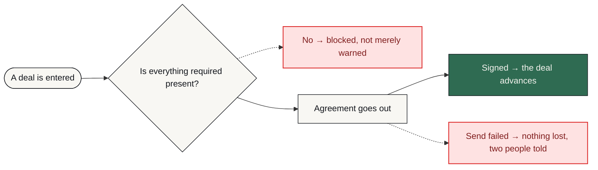

# M&A Deal-Flow Platform

**A deal cannot advance without the required fields logged, a signature request cannot fail silently, and every state change is auditable after the fact.**

     

> [!NOTE]
> **What this is.** A production-grade system built to a brief that businesses in this sector post publicly, in their own words — the problem exactly as they stated it, not one invented to demonstrate something. It was engineered the way anything a business actually depends on has to be: the failure paths designed before the features, every one of them logged and alerted rather than left to chance. It runs on my own infrastructure. It is ready to deploy for any business with this problem, and it has not been sold or deployed into a customer's business yet.

| | |
| :--- | :--- |
| **Built for** | Boutique M&A advisory firms |
| **The brief** | The problem exactly as businesses in this sector post it — public job briefs on Upwork and Fiverr, in their words, not my framing |
| **Industry** | M&A advisory |
| **Status** | running on my own n8n |
| **Failure paths designed** | 6 — each with how it is detected, what the system does about it, and who finds out |
| **My role** | Sole engineer — scoping, architecture, build, failure design and operation |
| **Availability** | Ready to deploy for any business with this problem — built once as a product, not as a one-off. Running on my own infrastructure; not sold yet. |

---

### On this page

[The problem](#the-problem) · [What changed](#what-changed) · [How it works](#how-it-works) · [When it breaks](#when-it-breaks) · [The stack](#the-stack) · [Limitations](#honest-limitations) · [Read deeper](#read-deeper)

---

## The problem

A boutique M&A advisory firm needed its NDA and deal-flow process to run without a human watching every step.

But a dropped signature request or a silent failure in a live deal costs a client's trust, or the deal itself. Off-the-shelf automation tools do not give this kind of visibility or recovery.

So the build started from the failure cases rather than the happy path.

## What changed

| | Before | After |
| :--- | :--- | :--- |
| **Deal advancement** | Whenever someone moved it | Blocked until required fields are logged |
| **A failed signature** | Discovered by asking | Retried five times, then dead-lettered and alerted |
| **Lost work** | Possible | Dead-letter table — nothing disappears |
| **Tracing a deal** | Search email | Correlation ID through every step |
| **Alerting** | One channel, or none | Two channels |

Before/after describes the change in process, not benchmarked throughput. Where a number is not measured, it is not claimed.

## How it works

A versioned PostgreSQL schema with state-machine enforcement, full audit logging, dead-letter tables and idempotency guarantees. The NDA workflow retries a failed send up to five times with exponential backoff, threads a correlation ID through every step, and raises dual alerts the moment a human is needed.

<table>
<tr>
<td width="42" valign="top" align="center"><b>01</b></td><td valign="top"><b>A deal is entered</b> Intake writes to a versioned schema, not a spreadsheet.</td>
</tr>
<tr>
<td width="42" valign="top" align="center"><b>02</b></td><td valign="top"><b>The state machine decides</b> A deal cannot move to the next stage without its required fields. Blocked, not warned — that distinction is the product.</td>
</tr>
<tr>
<td width="42" valign="top" align="center"><b>03</b></td><td valign="top"><b>The NDA goes out</b> And if the send fails it is retried five times with exponential backoff, not assumed successful.</td>
</tr>
<tr>
<td width="42" valign="top" align="center"><b>04</b></td><td valign="top"><b>Failure has somewhere to go</b> After five attempts the item lands in a dead-letter table and two alert channels fire. Nothing evaporates.</td>
</tr>
<tr>
<td width="42" valign="top" align="center"><b>05</b></td><td valign="top"><b>Everything is traceable</b> A correlation ID runs through every step, so one deal's whole path can be reconstructed months later.</td>
</tr>
<tr>
<td width="42" valign="top" align="center"><b>06</b></td><td valign="top"><b>Re-running is safe</b> Idempotency guarantees mean nothing runs twice.</td>
</tr>
</table>

### How it flows

What happens to the client's work, in the order they experience it. The internal build — node graph, execution order, prompts, thresholds — is deliberately not published.

<b>What the shapes mean</b> — colour is not the only signal

| Shape | Means |
| :--- | :--- |
| **rounded** | Where the client's process starts |
| **box** | Something the system does |
| **diamond** | A decision point |
| **slanted** | A person has to act |
| **green box** | The good outcome |
| **red box** | Failure path — held, escalated or alerted |

Red appears in exactly one role across every repo in this portfolio: where failure goes. Nowhere else. If you see red, something is being held, escalated or alerted.

> **Walk it interactively** — [`docs/index.html`](docs/index.html) is a single self-contained page. Download it, open it in any browser, and press **Break it** to watch the failure path light up. Nothing to install, no network calls.

## When it breaks

Most automation portfolios show you the happy path. The happy path is the easy half. This is the half that decides whether a system survives contact with a real business.

| What goes wrong | How it is detected | What the system does | Who finds out |
| :--- | :--- | :--- | :--- |
| **Required field missing** | State-machine guard | Deal cannot advance — blocked, not warned | Blocked state is visible and logged |
| **Signature send fails** | API error | Retried up to five times with exponential backoff | Alert only if all five fail |
| **All retries exhausted** | Retry count | Written to a dead-letter table, never dropped | Dual alert: Telegram and email |
| **Same action submitted twice** | Idempotency guarantee | Second submission does not re-run the step | Nobody — by design |
| **Tracing a problem after the fact** | Correlation ID threaded through every step | The whole path for one deal can be reconstructed | Whoever asks |
| **One alert channel is down** | Dual delivery | The other channel still lands | The human still finds out |

The default on an unhandled condition is to **stop and tell someone** — never to continue on a guess. A silent success is the failure mode that costs the most, because nobody goes looking for it.

## The stack

| Component | Why this one |
| :--- | :--- |
| **n8n** | Six workflows covering the deal lifecycle |
| **PostgreSQL** | Versioned schema, state machine, audit log and dead-letter tables |
| **DocuSign API** | The NDA send, retried rather than assumed |
| **OpenAI GPT-4** | Document handling inside the deal workflows |
| **Custom buyer portal (web)** | Where the advisory team works the pipeline |
| **Telegram + Email** | Two alert channels, because one channel is a single point of failure |

### Counted, not estimated

| | |
| :--- | :--- |
| Workflows | **6** |
| Retry attempts | **5, exponential backoff** |
| Alert channels | **2** |
| Schema version | **v2** |
| Actions audit-logged | **every one** |

These are counts from the built system — nodes, stages, versions, gates. No efficiency percentages are published here without a stated measurement method.

## Honest limitations

Every design decision costs something. These are the trade-offs in this build, stated by the person who made them.

- The state machine is strict by design. A firm that wants to advance a deal with fields missing will find it obstructive — which is the point.
- Dead-lettered items need a human to work the queue. The system guarantees nothing is lost, not that nothing needs attention.
- Schema is versioned at v2, so migrations are a real operational step rather than an afterthought.

## What is not in this repo

- **Data belonging to a real business.** None, in any form. Not anonymised, not sampled — there never was any.
- **Credentials and endpoints.** Never committed. See [`NOTICE.md`](NOTICE.md).
- **The workflow itself.** No exports, no node graph, no execution order, no prompts, no scoring thresholds, no integration wiring — not sanitised, not partial, not in a screenshot. That is the build, and the build is not portfolio material.

This repository documents *how the problem was thought about* — the failure paths, the trade-offs, the reasoning. That is what tells you whether to hire someone. A copy of the wiring would not.

This is a portfolio repository documenting a system I designed and built. It is not a product you can clone and run against your own accounts.

## Read deeper

| | |
| :--- | :--- |
| [01 · The problem](docs/01-problem.md) | The situation before, in full |
| [02 · The journey](docs/02-journey.md) | Step by step, from their side |
| [03 · Architecture](docs/03-architecture.md) | Diagrams and the reasoning |
| [04 · Failure handling](docs/04-failure-handling.md) | Every path, and where it lands |
| [05 · The stack](docs/05-stack.md) | What was chosen and what was rejected |
| [06 · Results](docs/06-results.md) | What is measured and what is not |
| [07 · Limitations](docs/07-limitations.md) | The trade-offs, in detail |

---

### Tell me what the process is

I will tell you honestly whether automating it is worth your money — including when the answer is no.

**K MD SAYAD RAHMAN** — AI Automation Engineer  
n8n · AI agents · production reliability  
[khandokarsayad@gmail.com](mailto:khandokarsayad@gmail.com) · [mdsadrhoman123@gmail.com](mailto:mdsadrhoman123@gmail.com) · [LinkedIn](https://www.linkedin.com/in/khandokarsayad) · [More systems](https://github.com/mdsadrhoman123-stack)

